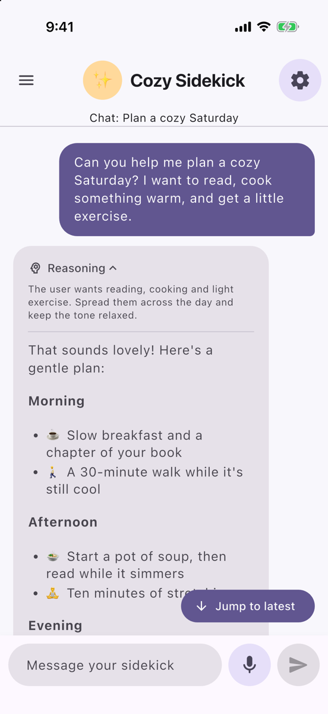
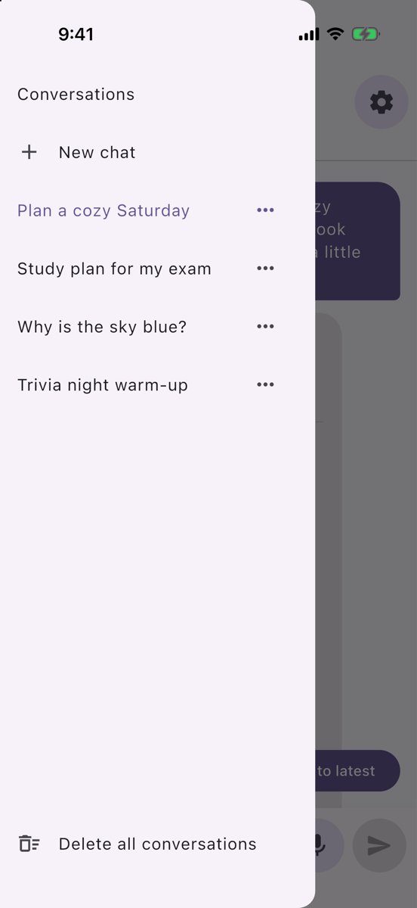
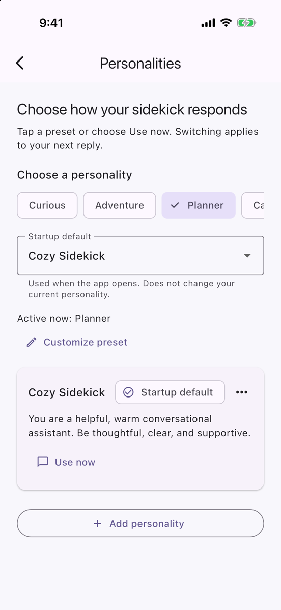
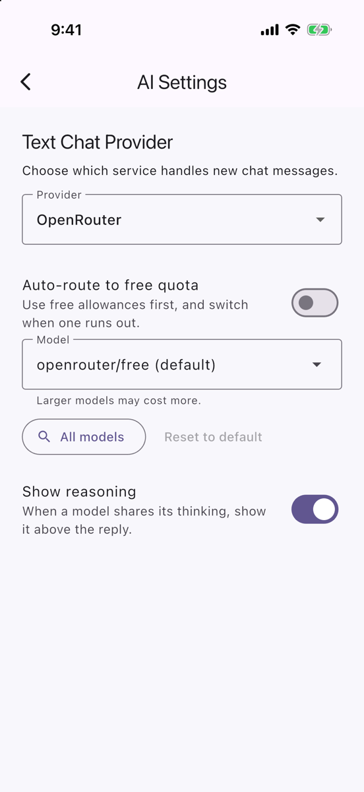

# Cozy Sidekick

[](https://github.com/scotty2hottyy/cozy_sidekick/actions/workflows/main.yml)

Cozy Sidekick is a Flutter chat app for iOS and Android. You bring your own AI provider, and you choose the sidekick's personality. Chats, personalities and settings are stored on the device. API keys are kept in the platform's secure storage.

## Demo

https://github.com/user-attachments/assets/ba1f11fd-e4a1-47cb-9d36-4b0129b8dc07

## Screenshots

<p>
  
  
  
  
</p>

## Features

- **Choose your provider.** Use OpenRouter, OpenAI, Groq or your own HTTP(S) chat server. You can switch providers at any time without restarting the app.
- **Choose a model for each provider.** Pick a suggested model, type any model ID, or search the provider's full model list.
- **Free-quota auto-routing.** Set up an ordered list of free routes (OpenRouter free models, Groq, and OpenAI's daily free tokens). The app sends each message to the first route that still has quota left. Each route can have its own daily limit, and the app shows how much of it is used and when it resets.
- **Streaming replies.** Replies appear as they arrive. A Stop button ends a reply early and keeps what has arrived so far, and Jump to latest returns you to the newest message.
- **Model reasoning.** Turn on Show reasoning to see a collapsible Reasoning section on replies from models that share their thinking.
- **Markdown and math.** Replies are formatted with Markdown and LaTeX. Long-press a reply to copy the original text.
- **Personalities.** Start with the built-in Cozy Sidekick, pick a preset (Curious, Adventure, Planner, Captain Quip), or write your own system instructions. You can switch personalities during a session or choose which one the app starts with.
- **Multiple conversations.** Start, switch, rename and delete chats from the drawer. Only the newest 20 messages of the current chat are sent to the provider.
- **Voice.** Dictate messages with speech-to-text, and choose to send them automatically when you stop speaking. Replies can be read aloud with your choice of device voice, language and speed.
- **Friendly errors.** Problems appear as plain messages. Key, model, credit, chat-length and custom-server setup problems include a Settings button that opens the screen to fix them. Network, timeout and rate-limit problems include Retry.

## Providers

| Provider | Default model | Key | Notes |
| --- | --- | --- | --- |
| [OpenRouter](https://openrouter.ai/keys) | `openrouter/free` | API key | The default on a new install. Free models, including the default, work without adding credit, within a daily request quota. |
| [OpenAI](https://platform.openai.com/api-keys) | `gpt-6-luna` | API key | Needs account credit. The project's model allowlist must include the model you pick. |
| [Groq](https://console.groq.com/keys) | `openai/gpt-oss-20b` | API key | Free tier with rate limits that vary by model. |
| Custom server | Chosen by the server | Access token | Any HTTP(S) server that implements the contract below. Get its URL and access token from whoever runs it. |

### Custom server contract

The app sends `POST {baseUrl}/chat` with `Authorization: Bearer <token>`:

```json
{
  "messages": [
    { "role": "system", "content": "<personality instructions>" },
    { "role": "user", "content": "Hi!" },
    { "role": "assistant", "content": "Hello!" },
    { "role": "user", "content": "What's new?" }
  ]
}
```

It expects a JSON reply that contains `message` and may also contain `reasoning`:

```json
{ "message": "Not much!", "reasoning": "optional" }
```

Reply with a 2xx status and a JSON object whose `message` is a non-empty string. Return 401 or 403 for a bad token. Replies are not streamed, and the app waits up to 60 seconds for one. Enter the base URL in the app without `/chat`.

## Getting started

### Requirements

- Flutter 3.44 or later on the stable channel (tested with 3.47.5), which includes Dart 3.13.3 or later
- Xcode and CocoaPods for iOS (iOS 15.0 or later)
- Android Studio or the Android SDK for Android

### Run the app

```bash
git clone https://github.com/scotty2hottyy/cozy_sidekick.git
```

```bash
cd cozy_sidekick
```

```bash
flutter pub get
```

```bash
flutter run
```

### Set up in the app

1. Open **Settings → API Credentials**, paste a key for your provider, tap **Save**, then tap **Test Connection**. For a custom server, also enter its Base URL and tap **Save URL** before testing.
2. Open **Settings → AI Settings** to choose the provider and model. You can also turn on **Auto-route to free quota** there.
3. Optional: change the personality in **Settings → Personality** and the voice options in **Settings → Voice & Speech**.

No keys are included in the repository, and the app never displays or logs a saved key. A fresh install starts without keys, even on an iPhone that had the app before.

### Install the Android build

Download `app-release.apk` from the [latest release](https://github.com/scotty2hottyy/cozy_sidekick/releases/latest) on your Android phone, open it, and allow installs from your browser when asked.

Each build is signed with a different key, so uninstall any earlier Cozy Sidekick build first. Uninstalling deletes its saved keys and chats.

Each merge to `main` also builds an APK. To try one, sign in to GitHub, open the latest successful run of the **Android CI** workflow under the repository's [Actions](https://github.com/scotty2hottyy/cozy_sidekick/actions) tab, and download `app-release.apk`. Only the newest one is kept, for 14 days.

## Settings

| Screen | What it controls |
| --- | --- |
| AI Settings | Provider, model, auto-routing and its routes, Show reasoning |
| API Credentials | Keys for each provider, the custom server URL and token, Test Connection |
| Personality | Presets, saved personalities, the current personality and the startup default |
| Voice & Speech | Dictation language, send when done, read-aloud mode, voice and speed |
| Appearance | Format replies, Show math, Dollar-sign math |
| Chat History | Clear the current chat, delete all conversations |

## Where data is stored

| Data | Storage |
| --- | --- |
| API keys and the custom server token | `flutter_secure_storage` (Keychain on iOS, Keystore on Android) |
| Conversations (up to 500 messages each) | `conversations.json` in the app's documents folder |
| Settings, personalities, routes and daily usage | `shared_preferences` |

Your chats stay on the device. Messages go only to the AI service that answers them (your chosen provider, or a free route when auto-routing is on), and dictation uses your phone's speech recognition service. Android backups are turned off, because saved keys can't be restored on another phone anyway.

## Project structure

```
lib/
  ai/          Provider interface, the OpenAI-compatible base, each provider, the auto-router, HTTP helpers
  models/      Messages, conversations, personalities, quota routes, formatting and speech settings
  services/    Chat, conversation storage, settings, keys, model lists, quotas, usage, speech and text-to-speech
  screens/     Chat, Settings and each settings screen
  widgets/     Message bubbles, formatted replies, the composer and the chat header
test/          Unit and widget tests, organized the same way as lib/
```

`AI_passdown.md` has detailed notes on each feature and the decisions behind it. Read it before you change an area.

## Development

### Checks

```bash
flutter analyze
```

```bash
flutter test
```

```bash
dart format lib test
```

CI runs `flutter analyze` and `flutter test` on every pull request to `main`. It does not check formatting, so run `dart format` before you push. Pushing a `v*` tag (for example `v1.0.0`) builds the APK and publishes it as a GitHub Release.

### Workflow

1. Each change starts as an issue on the Cozy Sidekick project board, written as Card, Conversation and Confirmation.
2. Create a branch named `<type>/<issue#>-<description>`, for example `feature/27-model-selection-per-provider` or `bugfix/40-model-access-errors`.
3. Open a pull request that says `Closes #<issue>`, and complete the Definition of Done in the PR template. That includes tests for new behavior, no keys in the diff or logs, a teammate's review, and an updated `AI_passdown.md`.
4. The product owner runs the card's Confirmation tests on the branch before it is merged.

## Team

- [@scotty2hottyy](https://github.com/scotty2hottyy)
- [@BrockBadeaux14](https://github.com/BrockBadeaux14)
- [@iwasella](https://github.com/iwasella)
- [@Jand245](https://github.com/Jand245)

Built for CSC 4330 (Software Engineering).
